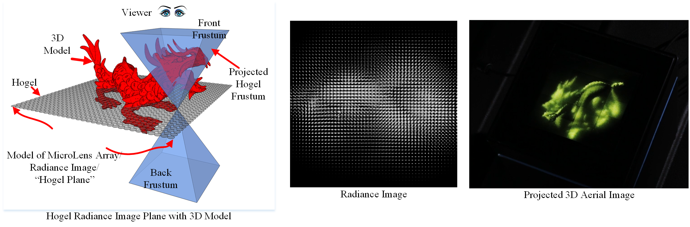

# LightField
Lightfield Radiance Image Rendering Demonstration and Tools

The lightfield display (LfD) radiance image is a raster description of a lightfield where every pixel in the image represents a unique ray within a 3D volume.  The LfD radiance image can be projected through an array of micro-lenses to project a perspective-correct 3D aerial image visible for all viewers within the LfDs projection frustum.  The synthetic LfD radiance image is comparable to the radiance image as captured by a plenoptic/light-field camera but is rendered from a 3D model or scene.  Synthetic radiance image rasterization is an example of extreme multi-view rendering as the 3D scene must be rendered from many (1,000s to millions) viewpoints into small viewports per update of the light-field display.  Therefore, LfD radiance image rendering is extremely time consuming and compute intensive.   

The code within the repository demonstrates two common methods for rasterizing lightfield radiance images: Double Frustum Rendering and Oblique Slice and Dice Rendering.

The Double Frustum algorithm renders radiance image views using two independent back and front perspective view frustums per radiance image micro-image. 

The Oblique Slice and Dice algorithm renders directions using sheared orthographic projections; after which, every oblique pixel must be sampled into the radiance image.

## Build using CMake
Building this project is a two-step process.  First, Group1 and Group5 of [3rdPartyLib](https://github.com/TLBurnett3/3rdPartyLibs) are required to be built and installed on the development/build platform.  Second, using CMake a platform specific make solution must be built and executed to create a build solution.  Currently, only Windows has been tested.

## Running Lightfield
The Lightfield executable requires a JSon file for definiting the execution parameters.  A few examples are included within the model directories: for example ./Models/Orchid/Orchid.json

### JSon File Description

##### JobName
Name of the Job

#### Render
Type of radiance image rendering:  DF or Oblique

#### Output Path 
Output directory

