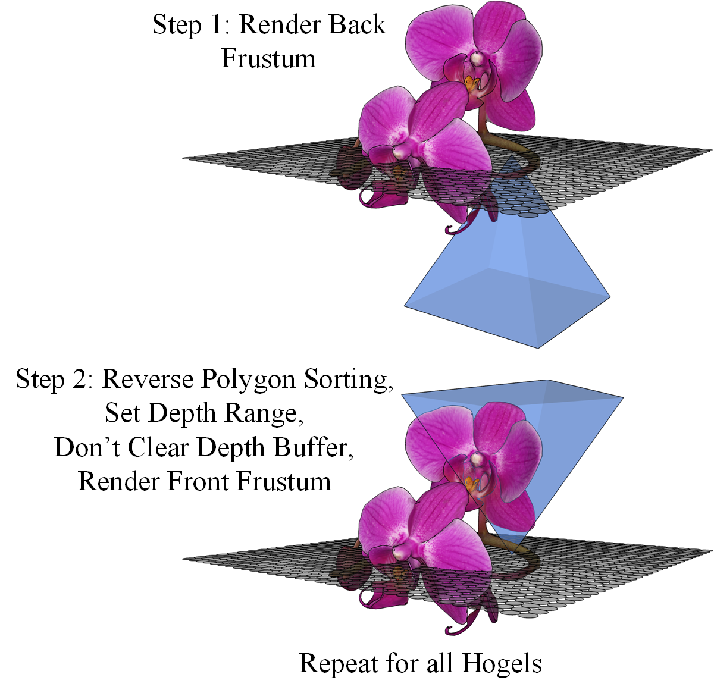

# LightField Radiance Image Rasterizer

The lightfield display (LfD) radiance image is a raster description of a lightfield where every pixel in the image represents a unique ray within a 3D volume.  The LfD radiance image can be projected through an array of micro-lenses to project a perspective-correct 3D aerial image visible for all viewers within the LfDs projection frustum.  The synthetic LfD radiance image is comparable to the radiance image as captured by a plenoptic/light-field camera but is rendered from a 3D model or scene.  Synthetic radiance image rasterization is an example of extreme multi-view rendering as the 3D scene must be rendered from many (1,000s to millions) viewpoints into small viewports per update of the light-field display.  Therefore, LfD radiance image rendering is extremely time consuming and compute intensive. 

The code within the repository demonstrates two common methods for rasterizing lightfield radiance images: Double Frustum Rendering and Oblique Slice and Dice Rendering.

The Double Frustum algorithm renders radiance image views using two independent back and front perspective view frustums per radiance image micro-image. 

The Oblique Slice and Dice algorithm renders directions using sheared orthographic projections; after which, every oblique pixel must be sampled into the radiance image.

## Source Code
* Src/Core - Contains the base code for the project
* Src/Render - Contains a simple OpenGL render engine
* Src/Tasks - Contains the algorithm processing tasks
* Src/Viewer - Contains a light-field radiance image viewer. See below.
* Src/Lightfield - Contains the main and executor for this project

## Build using CMake
Building this project is a two-step process.  First, Group1 and Group6 of [3rdPartyLib](https://github.com/TLBurnett3/3rdPartyLibs) are required to be built and installed on the development/build platform.  Second, using CMake a platform specific make solution must be built and executed to create a build solution.  Currently, only Windows has been tested.

## Running Lightfield
The Lightfield executable requires a JSon file for defining the execution parameters.  A few examples are included within the model directories: 

Double Frustum example: Lightfield ./Models/Orchid/Orchid.json

Oblique Slice & Dice example: Lightfield ./Models/Orchid/OrchidSnD.json

### JSon File Description

##### JobName
Name of the Job.

#### Render
Type of radiance image rendering:  DF or Oblique.

#### Output Path 
Output directory.

#### FieldOfView
Perspective camera frustum field of view for Double Frustum algorithm.

#### HogelSize
Size of the hogel micro-image in pixels.  Commonly referred to as directional resolution.

#### NumHogels
Defines the number of hogel micro-images in a radiance image.

#### zNearFar
The near and far values for the camera clip planes.

#### MemSize
Memory (in gigabytes) reserved for pixel swizzle for Oblique Slice and Dice algorithm

#### Tasks
List of post-render tasks available for execution:
* ProofImage - Write hogel proof image (center view and 8 extreme angle views)
* WriteAvi - Write hogels by row as AVI files
* WriteImg - Write hogels as png files
* ProofDepth - Generate a proof image of the hogel projection depth
* WriteDepthImg - Write hogel depth images as png files 
* SliceNDice - Slice Oblique images and write hogels by row as AVI files

#### ViewVolume
Defines a view volume transform matrix (VVT).  The radiance image camera definitions are created from the VVT.

#### Scene
Define a scene transform matrix.

#### Light
Defines a single light for the scene.

#### Models
Defines a list of models and transforms.