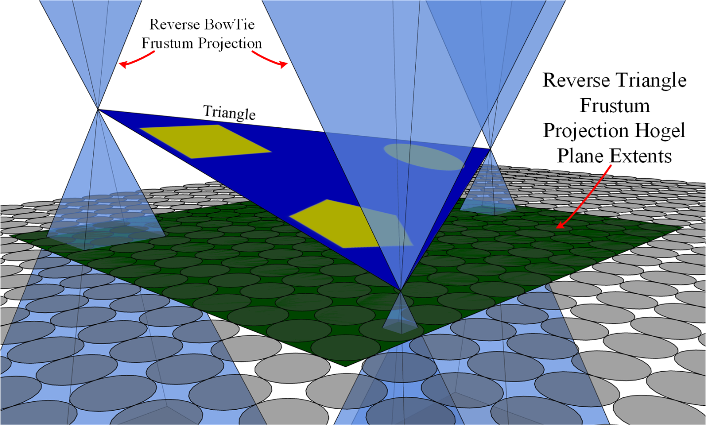

# Multi-view Processing Unit Simulator

The Multi-view Processing Unit (MvPU) is a C/C++ raster pipeline simulator used to research radiance image rendering.  C/C++ was chosen to ensure maximum flexibility over the render pipeline architecture.  

The traditional GPU render pipeline expects to render a single view per dispatch of the scene.   Therefore, radiance image rasterization becomes a serial rendering process managed by the host application which must understand the exact nature of the lightfield to render for a particular display.   While adding more computers can parallelize some of the rendering, it is at the expense of computation Size, Weight and Power  (SWaP).

The commonly used lightfield rasterization algorithms (Double Frustum and Oblique Slice & Dice) can require 1,000s to millions of render passes to generate a single radiance image.  The Double Frustum algorithm renders radiance image views using two independent back and front perspective view frustums per radiance image micro-image.   The Oblique Slice and Dice algorithm renders directions using sheared orthographic projections; after which, every oblique pixel must be sampled into the radiance image.

The objective of the BowTie algorithm is to improve the radiance image rendering process using optimizations inherit from a 2D array of pinhole frustums. The scene geometry is dispatched once from the host application and the BowTie rasterizer inverts the view-triangle rendering relationship to become triangle major in order to improve cache coherency when rendering.  The BowTie rasterizer uses the geometric structure of the radiance image definition (RID) to determine triangle-view intersections.  This greatly reduces the number of triangle clipping operations (can be used for object culling too) within the vertex processing stage of the BowTie rasterizer.  In addition, the BowTie rasterizer uses a 4-sided pinhole projection matrix with no near or far planes and clips in model space to reduce vertex transforms.

