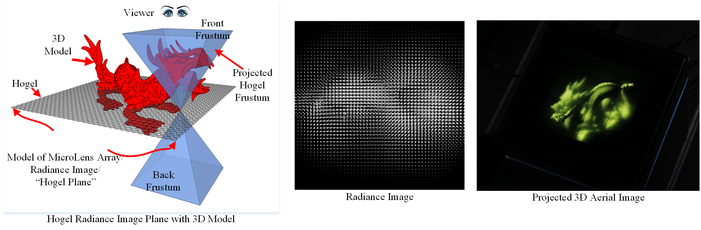
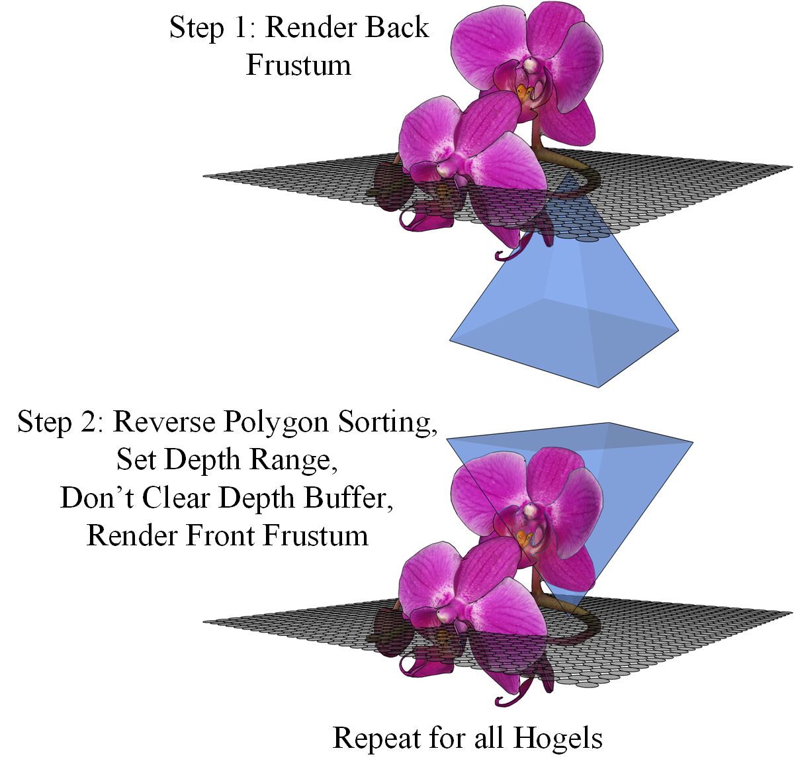
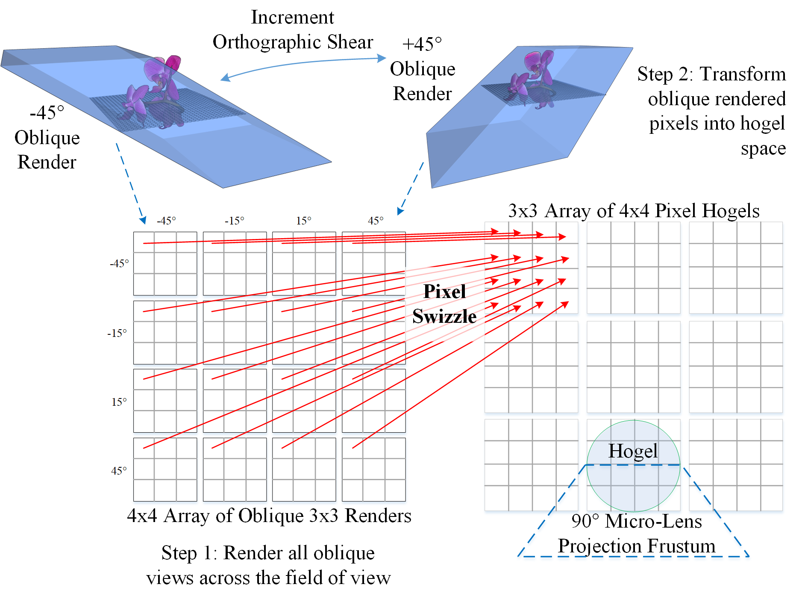

# LightField Radiance Image Rasterizer

The lightfield display (LfD) radiance image is a raster description of a lightfield where every pixel in the image represents a unique ray within a 3D volume.  The LfD radiance image can be projected through an array of micro-lenses to project a perspective-correct 3D aerial image visible for all viewers within the LfDs projection frustum.  The synthetic LfD radiance image is comparable to the radiance image as captured by a plenoptic/light-field camera but is rendered from a 3D model or scene.  Synthetic radiance image rasterization is an example of extreme multi-view rendering as the 3D scene must be rendered from many (1,000s to millions) viewpoints into small viewports per update of the light-field display.  Therefore, LfD radiance image rendering is extremely time consuming and compute intensive. 

The code within the repository demonstrates two common methods for rasterizing lightfield radiance images: Double Frustum Rendering and Oblique Slice and Dice Rendering.

The Double Frustum algorithm renders radiance image views using two independent back and front perspective view frustums per radiance image micro-image. 

The Oblique Slice and Dice algorithm renders directions using sheared orthographic projections; after which, every oblique pixel must be sampled into the radiance image.

## Build using CMake
Building this project is a two-step process.  First, Group1 and Group6 of [3rdPartyLib](https://github.com/TLBurnett3/3rdPartyLibs) are required to be built and installed on the development/build platform.  Second, using CMake a platform specific make solution must be built and executed to create a build solution.  Currently, only Windows has been tested.

## Running Lightfield
The Lightfield executable requires a JSon file for defining the execution parameters.  A few examples are included within the model directories: 

Double Frustum example: Lightfield ./Models/Orchid/Orchid.json

Oblique Slice & Dice example: Lightfield ./Models/Orchid/OrchidSnD.json

### JSon File Description

| JSON Parameter    | Description                                                      | Options                                                 |
|:------------------|:-----------------------------------------------------------------|:--------------------------------------------------------|
| JobName           | Name of the Job.                                                 |                                                         |
| Render            | Type of radiance image rendering                                 | DoubleFrustum or Oblique                                |
| OutputPath        | Output directory                                                 |                                                         |
| FieldOfView       | Camera frustum field of view                                     |                                                         |
| HogelSize         | Size of the hogel micro-image in pixels.  Commonly referred to as directional resolution. |                                |
| NumHogels         | Defines the number of hogel micro-images in a radiance image     |                                                         | 
| zNearFar          | The near and far values for the DF camera clip planes            |                                                         |
| MemSize           | Memory (in gigabytes) reserved for pixel swizzle for Oblique Slice and Dice algorithm     | Must be larger than HogelSize * NumHogels  * 3          |
| Tasks             | List of post-render tasks for execution                          |                                                         |
|                   | ProofImage - Write hogel proof image (center view and 8 extreme angle views) |                                             |
|                   | WriteAvi - Write hogels by row as AVI files                      |                                                         |
|                   | WriteImg - Write hogels as png files                             |                                                         |
|                   | ProofDepth - Generate a proof image of the hogel projection depth |                                                        |
|                   | WriteDepthImg - Write hogel depth images as png files            |                                                         |
|                   | SliceNDice - Slice Oblique images and write hogels by row as AVI files  |                                                  |
| ViewVolume        | Defines a view volume transform matrix (VVT)                     |                                                         |
| Scene             | Define a scene transform matrix                                  |                                                         |
| Light             | Defines a single light for the scene                             |                                                         |
| Models            | Defines a list of models and transforms                          |                                                         |
